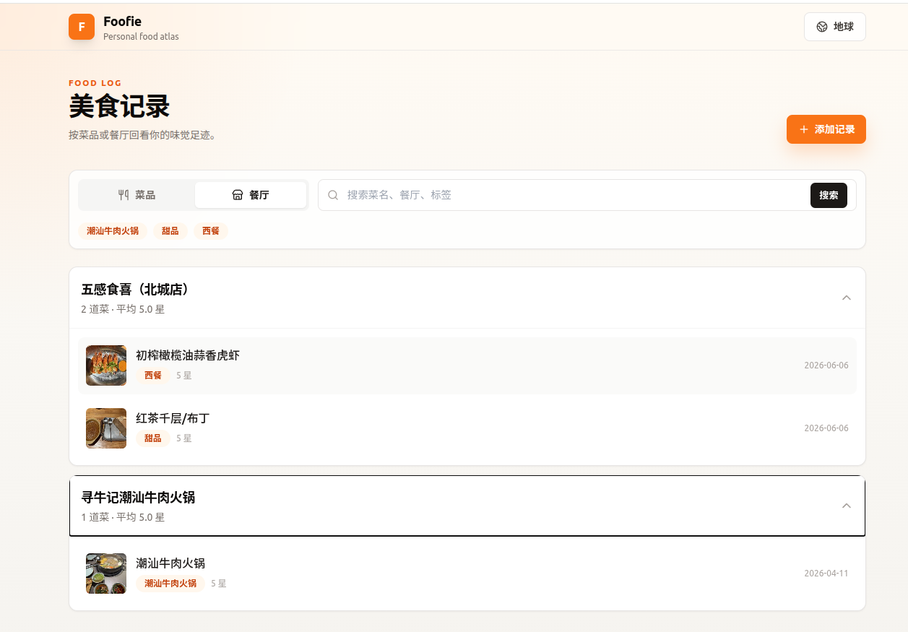
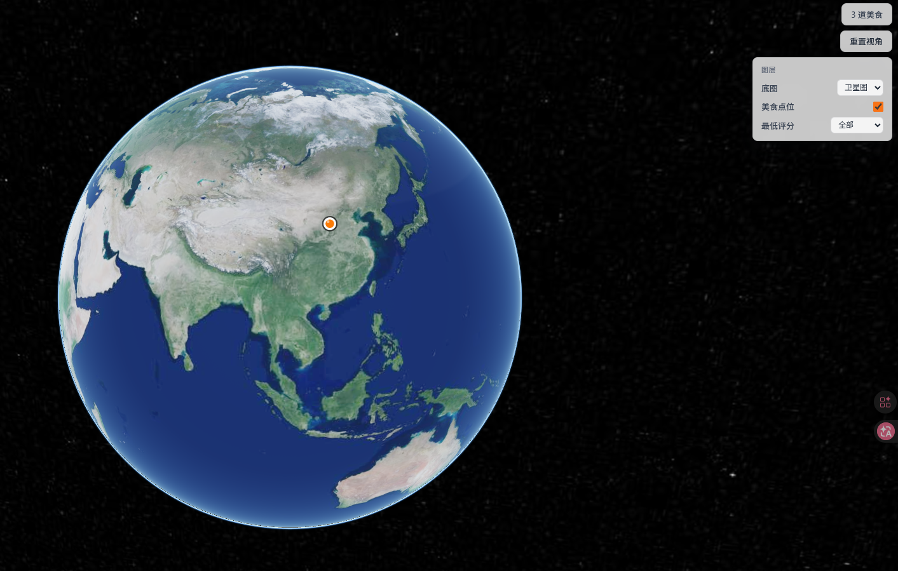
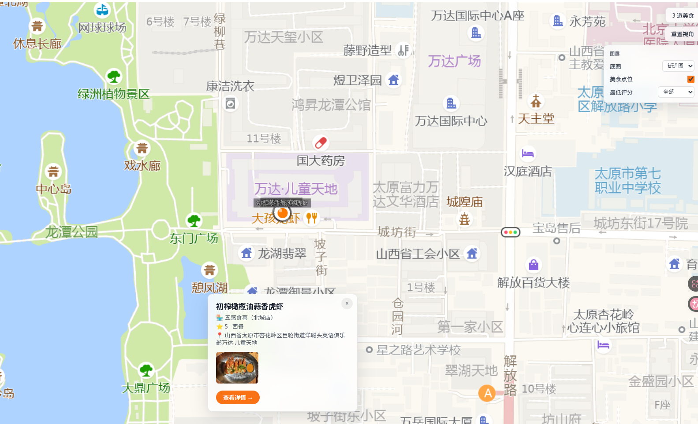

# 🍜 Foofie — 美食记录

记录你品尝的每一道美味，在 3D 地球上点亮足迹。

## 功能

- 📝 **美食记录** — 菜名、餐厅、菜系标签、评分、照片、日期
- 🌍 **3D 地球** — Cesium 地球展示所有美食点位，支持卫星图/街道图切换
- 📍 **智能定位** — 浏览器 GPS 自动定位 + IP 兜底，高德 API 转 GCJ-02 坐标
- 🗺️ **地图选点** — 高德交互地图选点 + POI 搜索（支持搜店名）
- 🏷️ **地址反查** — 自动逆地理编码，显示「山西省太原市万柏林区…」而非裸坐标
- ⭐ **评分筛选** — 按最低评分过滤地球点位

## 界面截图

| 菜品视图 | 餐厅视图 |
|---------|---------|
|  |  |

| 3D 地球 | 点位详情 |
|--------|---------|
|  |  |

## 技术栈

| 层 | 技术 |
|---|---|
| 后端 | Python FastAPI + SQLite |
| 前端 | Jinja2 模板 + Tailwind CSS |
| 地球 | CesiumJS 1.130 + 高德瓦片（GCJ-02） |
| 地图 | 高德 JS API 2.0 + REST API |
| 部署 | Uvicorn + Nginx + systemd |

## 项目结构

```
foofie/
├── main.py           # FastAPI 应用入口
├── database.py       # SQLite 数据库操作
├── models.py         # 数据模型
├── photo_utils.py    # 照片上传/缩略图
├── foofie.db         # SQLite 数据库文件
├── requirements.txt  # Python 依赖
├── static/css/       # 样式
├── templates/        # Jinja2 模板
│   ├── base.html     # 基础布局
│   ├── index.html    # 首页（菜品/餐厅视图）
│   ├── add.html      # 添加记录（定位 + 地图选点）
│   ├── detail.html   # 记录详情
│   └── globe.html    # 3D 地球页
├── uploads/          # 用户上传照片
├── thumbnails/       # 缩略图
└── tests/            # 单元测试
```

## 快速开始

```bash
# 安装依赖
cd foofie
pip install -r requirements.txt

# 启动服务
uvicorn foofie.main:app --host 0.0.0.0 --port 3459
```

访问 http://localhost:3459

## 坐标系统

```
手机 GPS（WGS-84）
    ↓ 原样入库
数据库（WGS-84）
    ↓ wgs84ToGcj02() 显示时转换
Cesium 地球（GCJ-02）→ 高德瓦片
```

- **入库**：浏览器 GPS 返回 WGS-84，直接存储
- **地图选点**：高德返回 GCJ-02，`gcj02ToWgs84()` 转 WGS-84 入库
- **显示**：球面 `wgs84ToGcj02()` 转 GCJ-02 对齐高德瓦片

## 环境变量

无必填环境变量。高德 API Key 硬编码在前端（仅用于公开 REST API）。

## License

MIT
